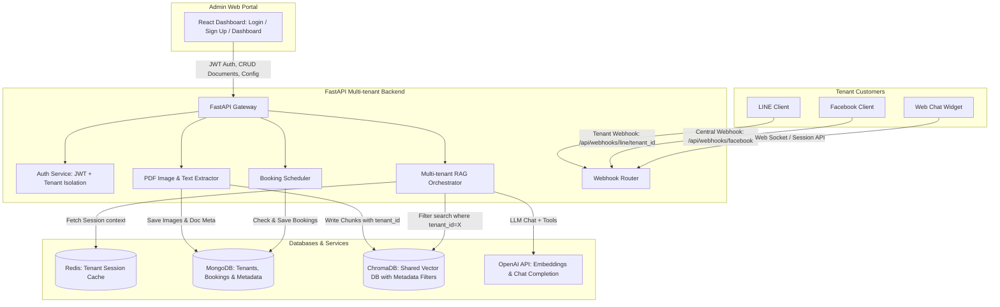

# System Architecture: Omnichannel AI Business Assistant (Multi-tenant SaaS)

This document outlines the architecture, data flow, integrations, and security design for the Omnichannel AI Business Assistant.

---

## 1. System Overview

The system is designed as a **Multi-tenant SaaS (Software as a Service)** platform:
1. **Multi-tenant Admin Portal (React + Vite)**: A web dashboard where multiple business owners can sign up, log in, configure their settings (API Keys, LINE Tokens, Facebook Page tokens), upload files, manage their business knowledge base, and view customer bookings.
2. **AI Assistant API (FastAPI + Python)**: An asynchronous server that handles multi-tenant auth, parses files, processes chat webhooks from LINE/Facebook, retrieves vector embeddings, and schedules bookings.
3. **Omnichannel Chat Integrations**: Customers of each tenant can interact with the tenant's AI chatbot via LINE, Facebook Messenger, or Web Chat.

---

## 2. Multi-tenant Architecture Diagram

---

## 3. Core Modules & Flow Detail

### A. Data Isolation (`tenant_id` Scoping)
To ensure complete isolation of business data between tenants:
- **MongoDB**: Every record in the `documents`, `bookings`, and `configurations` collections includes a `tenant_id` field.
- **ChromaDB**: Embeddings are written with `tenant_id` in their metadata. During search, queries are executed with a metadata filter: `{"tenant_id": tenant_id}` to prevent cross-tenant data leakage.
- **Redis**: Caching keys are partitioned: `session:{tenant_id}:{session_id}`.

### B. Image Extraction & RAG Data Flow
1. **Document Upload**: Admin uploads a PDF document.
2. **Text & Image Parsing**:
   - The backend extracts textual content.
   - Using libraries like `PyMuPDF` or `pdfplumber`, the parser extracts embedded images, saves them locally in `/backend/static/images/{tenant_id}/{doc_id}/`, and records the file metadata and image references in **MongoDB**.
   - Text is split into overlapping chunks, maintaining references to the pages they originated from.
3. **Similarity Retrieval**:
   - The user query is embedded.
   - ChromaDB is queried with `where={"tenant_id": tenant_id}` filter.
   - Relevant chunks are retrieved. If a retrieved chunk has associated images (extracted from the same page), the image URLs are compiled.
4. **AI Processing**: The query, text context, and image URLs are forwarded to the OpenAI LLM. The AI formats its reply and attaches the relevant images in the response payload.

### C. Omnichannel Webhook Routing
1. **LINE Webhook**:
   - Each tenant registers a unique webhook URL in the LINE Developers Console:
     `https://yourdomain.com/api/webhooks/line/{tenant_id}`
   - The backend extracts the `tenant_id` from the path parameter, retrieves that tenant's LINE Channel Access Token/Secret from MongoDB, validates the signature, and processes the message event.
2. **Facebook Messenger Webhook**:
   - Meta webhooks require a centralized URL: `https://yourdomain.com/api/webhooks/facebook`.
   - The webhook receives message payloads containing a `recipient.id` (Facebook Page ID).
   - The backend queries MongoDB to find which tenant owns the Facebook Page ID, loads their credentials, and executes the conversation logic.
3. **Web Chat**:
   - Embedded chat widget uses a unique workspace script passing the `tenant_id`.

### D. Chat-based Booking Flow (Automation Flow)
1. **Intent Analysis**: The AI uses OpenAI Function Calling (Tools) to detect booking requests.
2. **Availability Check**: If the user asks for a date/time (e.g. "นัดวันศุกร์นี้ บ่าย 2"), the AI triggers the booking function. The backend checks MongoDB's `bookings` collection for scheduling conflicts under the given `tenant_id`.
3. **Fulfillment**: 
   - If vacant, the booking is recorded as `confirmed` (or `pending`).
   - The AI responds to the user confirming the booking details (e.g. "ระบบลงนัดให้คุณสมชายเรียบร้อยแล้วค่ะ: วันศุกร์ที่ 5 มิ.ย. เวลา 14:00 น.").

---

## 4. Authentication & Security

- **User Authentication**: Sign Up and Sign In features for tenant accounts. Secures passwords using `bcrypt`. Generates JWT access tokens with expiration times.
- **Endpoint Security**: FastAPI backend verifies the Bearer token in the `Authorization` header on all protected routes, validating the user session and identifying their associated `tenant_id`.
- **Webhook Verifications**:
  - **LINE**: Computes HMAC-SHA256 signature using the tenant's `Channel Secret` on the request body and compares it with `X-Line-Signature`.
  - **Facebook**: Validates request body using HMAC-SHA256 signature against Meta App Secret.
